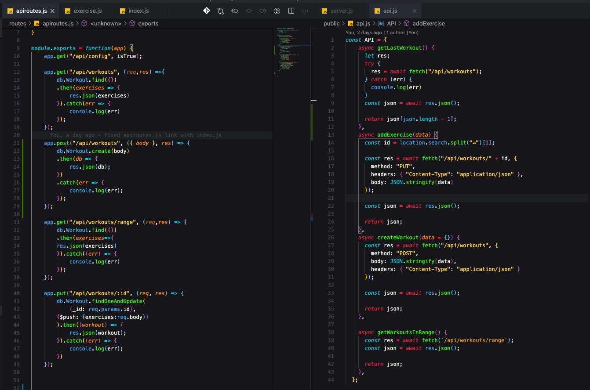

# workout-tracker-nosql
Create a workout tracker app.

## Description
A consumer will reach their fitness goals more quickly when they track their workout progress.

This app is created to assist them with that.

## Deployed Application Link
This application is deployed on Heroku and supported by MongoDB Atlas.

[Visit it here.](https://workout-tracker-nosql-app.herokuapp.com/)

## Contents
This application is structured with MVC file architecture to include the following directories and files.

* Models: containing the exercise.js and index.js models
* Public: containing Images Directory, front-end js files, htmls, and style.css.
* Routes: containing the htmlroutes.js and apiroutes.js files
* Seeders: containing the seed.js file.
* Package.JSON: incorporating npm packages].
* Package-lock.JSON
* README.md
* server.js
* .env
* .gitignore

## Application Requirements
These are referenced within the [instructions.md](./public/instructions.md)

## Usage
This app required setting up a Mongo database with a Mongoose schema and handles routes with Express.

It also requires the following npm packages to be installed:
* seed
* nodemon
* mongoose
* morgan
* express
* dotenv

## Challenges 

Initially, I struggled with navigating the MongoDB Atlas dashboard and getting my app to connect to it where mongoose was running as required.

Once that was solved. I struggled with the ambiguity of the project initially thinking that multiple models were needed to take in user data points like name, as well as having different models for 'cardio' and 'resitance' exercises respectively. 

Going through the exercise.js and api.js files, as well as the index.html in the public directory - I began to see clues as to how the backend needed to be structured and how to name related elements that were already referenced on the front end.

## Credits & Contributions

During office hours, TA-Peter Colella, helped me use one of my view routes as the method for troubleshooting connecting to localhost and ultimately my heroku app. We were close to solving before time was called for class.

Big thanks to fellow teammate, Alexander Flemming, for taking the time to continue helping me troubleshoot my MongoDB Atlas set up issues connecting to Heroku. From this I was able to get it connected and get it working.

Additionally, I had assistance from my tutor in getting a better understanding of the "how" behind setting up the app.put 'update' route and the logic of how a virtual works. He also helped me better understand dotenv and environment elements that could be integrated in to an application for ease of use.

## Badge

## License
Copyright 2020 - Ryan Flanagan

Permission is hereby granted, free of charge, to any person obtaining a copy of this software and associated documentation files (the "Software"), to deal in the Software without restriction, including without limitation the rights to use, copy, modify, merge, publish, distribute, sublicense, and/or sell copies of the Software, and to permit persons to whom the Software is furnished to do so, subject to the following conditions:

The above copyright notice and this permission notice shall be included in all copies or substantial portions of the Software.

THE SOFTWARE IS PROVIDED "AS IS", WITHOUT WARRANTY OF ANY KIND, EXPRESS OR IMPLIED, INCLUDING BUT NOT LIMITED TO THE WARRANTIES OF MERCHANTABILITY, FITNESS FOR A PARTICULAR PURPOSE AND NONINFRINGEMENT. IN NO EVENT SHALL THE AUTHORS OR COPYRIGHT HOLDERS BE LIABLE FOR ANY CLAIM, DAMAGES OR OTHER LIABILITY, WHETHER IN AN ACTION OF CONTRACT, TORT OR OTHERWISE, ARISING FROM, OUT OF OR IN CONNECTION WITH THE SOFTWARE OR THE USE OR OTHER DEALINGS IN THE SOFTWARE.